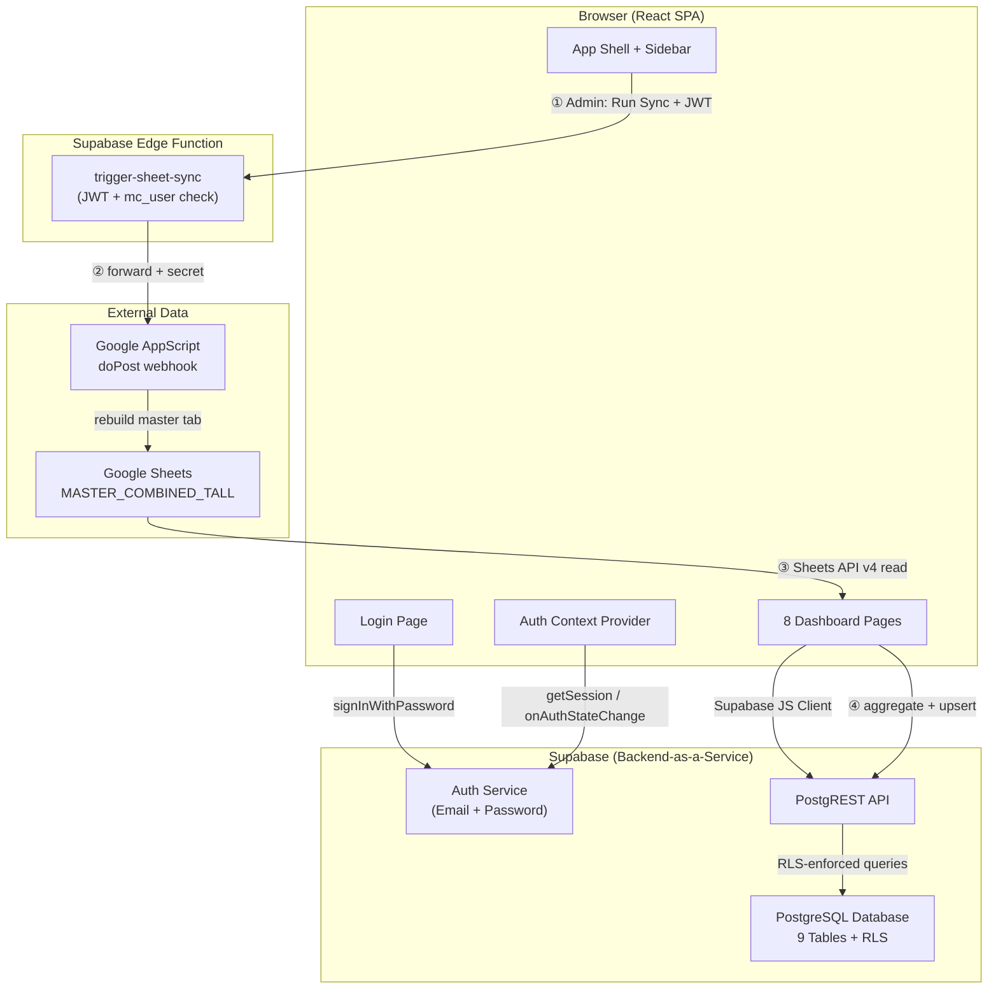
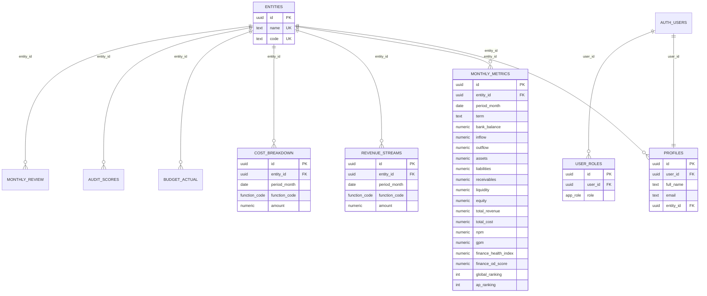
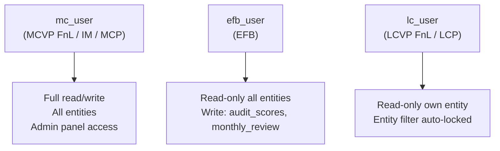
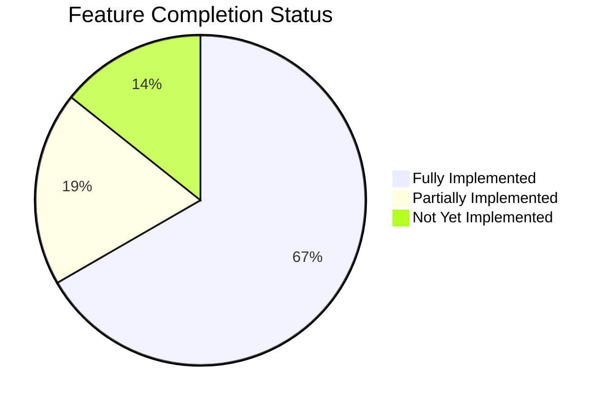

# ASL Finance Intelligence Dashboard — System Report

> **Version**: 1.1 (Sync sections reconciled)
> **Date**: 24 April 2026 · **Reconciled**: 2026-06-17
> **Prepared for**: AIESEC Sri Lanka — Finance & Legal

> [!NOTE]
> **2026-06-17 reconcile:** the **data-pipeline (§5), enum (§3), and architecture (§1)**
> sections have been updated to match the current Edge-Function + AppScript syncer. For the
> authoritative, code-verified description of the sync, see
> [`.claude/docs/syncer-architecture.md`](.claude/docs/syncer-architecture.md). Other
> sections of this report may still reflect the 24 April 2026 snapshot — trust the code where
> they conflict.

---

## Table of Contents

1. [System Architecture](#1-system-architecture)
2. [Technology Stack](#2-technology-stack)
3. [Database Schema](#3-database-schema)
4. [Security & RBAC Model](#4-security--rbac-model)
5. [Data Pipeline — Google Sheets Sync](#5-data-pipeline--google-sheets-sync)
6. [Page-by-Page Feature Inventory vs Requirements](#6-page-by-page-feature-inventory)
7. [Work Completed (Change Log)](#7-work-completed)
8. [Known Issues & Bugs](#8-known-issues--bugs)
9. [Future Implementations Roadmap](#9-future-implementations-roadmap)
10. [Security Testing Recommendations](#10-security-testing-recommendations)
11. [Business Logic Testing Plan](#11-business-logic-testing-plan)

---

## 1. System Architecture



> See [`.claude/docs/syncer-architecture.md`](.claude/docs/syncer-architecture.md) for the
> full two-step flow, secret/key trust model, and known deviations.

### Key Design Decisions

| Decision | Rationale |
|----------|-----------|
| **SPA (not SSR)** | Internal tool; no SEO needed. Simpler deployment. |
| **Supabase RLS** | Row-Level Security policies at the database level — even if the UI is bypassed, data isolation holds. |
| **Two-step server-gated sync** | Sync is a two-step flow: (1) the browser asks the `trigger-sheet-sync` Edge Function (JWT + `mc_user` gate) to run an AppScript webhook that rebuilds the `MASTER_COMBINED_TALL` tab; (2) the browser reads that tab via the public Sheets API and upserts to Postgres. The webhook URL + secret stay server-side; only the step-2 read uses a browser-exposed API key. |
| **Proxy-based Supabase client** | Lazy initialization avoids crashes if env vars are missing during build. |
| **First-user-as-admin** | The `handle_new_user()` trigger auto-assigns `mc_user` role to the first signup, bootstrapping the system. |

---

## 2. Technology Stack

| Layer | Technology | Version |
|-------|-----------|---------|
| **Framework** | React + TanStack Start | React 19.2, TanStack Router 1.168 |
| **Build** | Vite | 7.3.1 |
| **Styling** | Tailwind CSS v4 + tw-animate-css | 4.2.1 |
| **UI Components** | Radix UI (via shadcn/ui) | Multiple packages |
| **Charts** | Recharts | 3.8.1 |
| **Auth & Database** | Supabase (PostgreSQL + Auth) | supabase-js 2.104 |
| **Date Handling** | date-fns | 4.1.0 |
| **Form Validation** | Zod + React Hook Form | Zod 3.24 |
| **Toasts** | Sonner | 2.0.7 |
| **Linting** | ESLint + Prettier | 9.32 / 3.7.3 |
| **Language** | TypeScript | 5.8.3 |

### Project Structure

```
Finance Dashboard/
├── .env                          # Supabase + Google API credentials
├── package.json                  # Dependencies
├── src/
│   ├── components/
│   │   ├── AppShell.tsx          # Sidebar + header layout
│   │   ├── Filters.tsx           # Entity/date/function/term filter bar
│   │   ├── KpiCard.tsx           # Reusable KPI metric card
│   │   └── ui/                   # shadcn/ui primitives (15+ components)
│   ├── hooks/
│   │   └── useSheetSync.ts       # Custom hook for Google Sheets sync
│   ├── integrations/
│   │   ├── googleSheets/
│   │   │   ├── client.ts         # Google Sheets API HTTP client
│   │   │   ├── mapper.ts         # GFB code classifier + LC mapper
│   │   │   ├── sync.ts           # Sync orchestrator (aggregate + upsert)
│   │   │   └── index.ts          # Public exports
│   │   └── supabase/
│   │       ├── client.ts         # Supabase JS client (lazy Proxy)
│   │       └── types.ts          # Auto-generated DB types
│   ├── lib/
│   │   ├── auth.tsx              # AuthProvider context + useAuth hook
│   │   ├── finance.ts            # Finance types, formatters, fetch functions
│   │   └── utils.ts              # cn() utility
│   ├── routes/
│   │   ├── __root.tsx            # HTML shell + 404 page
│   │   ├── index.tsx             # / → redirects to /overview
│   │   ├── login.tsx             # Login / Signup page
│   │   ├── _app.tsx              # Auth guard + layout wrapper
│   │   ├── _app.overview.tsx     # Global Overview (Home)
│   │   ├── _app.lc.tsx           # LC Dashboard
│   │   ├── _app.budget.tsx       # Budget vs Actual
│   │   ├── _app.performance.tsx  # Performance Analysis
│   │   ├── _app.audit.tsx        # EFB Audit Results
│   │   ├── _app.review.tsx       # Monthly Review
│   │   ├── _app.contacts.tsx     # Help & Contacts
│   │   └── _app.admin.tsx        # Admin (MC only)
│   ├── router.tsx                # TanStack Router config
│   └── styles.css                # Tailwind v4 design tokens
└── supabase/
    └── migrations/               # SQL schema file
```

---

## 3. Database Schema

### Entity Relationship Diagram



### Table Summary

| Table | Records | Purpose |
|-------|---------|---------|
| `entities` | 11 | All LCs (CC, CN, CS, Kandy, USJ, NSBM, Ruhuna, Rajarata, SLIIT, NIBM, Wayamba) |
| `profiles` | 1+ | User profiles linked to auth.users |
| `user_roles` | 1+ | RBAC role assignments (lc_user, mc_user, efb_user) |
| `monthly_metrics` | ~245 | Aggregated monthly financial KPIs per entity |
| `revenue_streams` | ~715 | Revenue by function code per entity per month |
| `cost_breakdown` | ~453 | Cost by function code per entity per month |
| `budget_actual` | 0 | Budget vs Actual data (awaiting data entry) |
| `audit_scores` | 0 | EFB audit scores (awaiting data entry) |
| `monthly_review` | 0 | Monthly review pass/fail records (awaiting data entry) |

### Enums

- **`app_role`**: `lc_user` | `mc_user` | `efb_user`
- **`function_code`** (current frontend list, source of truth = `src/lib/finance.ts`):
  `iGV` | `iGT` | `oGV` | `oGT` | `ELD` | `EwA` | `Miscellaneous` | `NMF` | `Conference` |
  `National Conference Delegation`

> [!WARNING]
> **Enum drift:** the original migration defined `function_code` as only 7 values
> (`iGV, iGT, oGV, oGT, ELD, EwA, BD`). The 10-value list above is newer; the live Supabase
> enum must have been altered out-of-band. Treat `src/lib/finance.ts` as the UI source of
> truth and verify the live DB enum before relying on the migration file.

### Indexes

All finance tables have composite indexes on `(entity_id, period_month)` for fast filtered queries.

---

## 4. Security & RBAC Model

### Role Hierarchy



### Security Layers

| Layer | Implementation | Status |
|-------|---------------|--------|
| **1. Authentication** | Supabase Auth (email + password, JWT tokens) | ✅ Working |
| **2. Authorization (DB)** | PostgreSQL RLS policies on ALL 9 tables | ✅ Applied |
| **3. Authorization (UI)** | Entity filter auto-locked for LC users; Admin page hidden for non-MC | ✅ Working |
| **4. SECURITY DEFINER functions** | `has_role()`, `get_user_entity()`, `can_read_entity()` bypass RLS to avoid recursion | ✅ Applied |
| **5. Auto-provisioning** | `handle_new_user()` trigger creates profile + auto-assigns first user as MC admin | ✅ Working |

### RLS Policy Matrix

| Table | LC (own entity) | MC (all) | EFB (all) |
|-------|:-:|:-:|:-:|
| `entities` | SELECT | ALL | SELECT |
| `profiles` | SELECT own | SELECT/UPDATE all | SELECT all |
| `user_roles` | SELECT own | ALL | SELECT own |
| `monthly_metrics` | SELECT | SELECT/INSERT/UPDATE/DELETE | SELECT |
| `revenue_streams` | SELECT | SELECT/INSERT/UPDATE/DELETE | SELECT |
| `cost_breakdown` | SELECT | SELECT/INSERT/UPDATE/DELETE | SELECT |
| `budget_actual` | SELECT | SELECT/INSERT/UPDATE/DELETE | SELECT |
| `audit_scores` | SELECT | SELECT/INSERT/UPDATE/DELETE | SELECT/INSERT/UPDATE |
| `monthly_review` | SELECT | SELECT/INSERT/UPDATE/DELETE | SELECT/INSERT/UPDATE |

> [!WARNING]
> **EFB write access**: EFB users can INSERT/UPDATE audit_scores and monthly_review but NOT DELETE. This is by design — audit records should not be deleted by the auditors themselves.

---

## 5. Data Pipeline — Google Sheets Sync

> **Canonical reference:** [`.claude/docs/syncer-architecture.md`](.claude/docs/syncer-architecture.md).
> The summary below is kept current as of 2026-06-17.

### Architecture (two-step)

```mermaid
flowchart LR
    U["Admin UI<br/>useSheetSync"] -->|① POST mode/term/month + JWT| EF["Edge Function<br/>trigger-sheet-sync<br/>JWT + mc_user gate"]
    EF -->|② forward + secret| AS["AppScript doPost<br/>rebuild master tab"]
    AS --> GS["Google Sheet<br/>MASTER_COMBINED_TALL"]
    GS -->|③ SA OAuth read| PF["Edge Function<br/>pull-sheet-data<br/>Service Account auth"]
    PF -->|④ {ok,values}| B["client.ts<br/>fetchSheetData()"]
    B --> C["mapper.ts<br/>parseRow() → GFB_DICTIONARY<br/>LC_CODE_TO_NAME"]
    C --> D["sync.ts<br/>group by (entity, month)<br/>aggregate, derive NPM/liquidity"]
    D -->|④ upsert via PostgREST| E["Supabase DB<br/>monthly_metrics<br/>revenue_streams<br/>cost_breakdown"]
```

> The AppScript that performs step ② is mirrored at
> [`appscript/master-combined-tall-sync.gs`](appscript/master-combined-tall-sync.gs).

### Sheet Format

| Column | Example | Purpose |
|--------|---------|---------|
| LC | CC, Kandy, USJ | LC code → maps to entity name |
| LC_Term | 24-25 | AIESEC term |
| Year | 2025 | Calendar year |
| Month | Jan, Feb | Month name |
| Date | 01-Jan-2025 | Full date |
| Report_Type | PnL, CFS | Profit & Loss or Cash Flow Statement |
| GFB_Code | 70101, 10101 | Global Finance Book code |
| Description | iGV Exchange Revenue | Line item description |
| Amount | 50000 | LKR amount |

### Classification Logic

> [!IMPORTANT]
> **Updated 2026-06-17.** Classification no longer relies on GFB-code *prefix* ranges or
> description *keyword* matching. `mapper.ts` now uses an **exact `GFB_DICTIONARY`** keyed on
> the full GFB code (e.g. `7001-EX-RV-LC`). Each entry maps to
> `{ category, functionCode, balanceField }`.

| `category` | Source codes (examples) | Where it lands |
|-----------|-------------------------|----------------|
| `revenue` | `7001-EX-RV-LC` … `7501-NE-RV-LC` | `total_revenue` + `revenue_streams` per function |
| `cost` | `7601-EX-CO-LC` … `8402-NE-CO-LC` | `total_cost` + `cost_breakdown` per function |
| `cash_flow` | `13xx-OA-CI-LC` (inflow), `14xx-OA-CO-LC` (outflow) | `inflow` / `outflow` |
| `balance_sheet` | `85xx`/`86xx`/`87xx`/`88xx` | `bank_balance`, `assets`, `receivables`, `petty_cash`, `reserves`, `equity`, `liabilities` |
| `unknown` | any code not in the dictionary | skipped |

### Function Code Extraction

The dictionary assigns each revenue/cost code a `FunctionCode` directly. The function set is
the 10-value list in §3 (`iGV, iGT, oGV, oGT, ELD, EwA, Miscellaneous, NMF, Conference,
National Conference Delegation`) — **not** the old 7-value keyword scheme. See
[`src/integrations/googleSheets/mapper.ts`](src/integrations/googleSheets/mapper.ts) for the
full `GFB_DICTIONARY`.

### Sync Statistics (Last Run)

| Metric | Count |
|--------|-------|
| Total rows processed | 7,214 |
| Monthly metric entries | 245 |
| Revenue stream entries | 715 |
| Cost breakdown entries | 453 |
| Entities covered | 11 LCs |
| Date range | Feb 2024 → Jan 2026 |
| Total revenue (all time) | LKR 183,312,032 |

---

## 6. Page-by-Page Feature Inventory

### Page 1: Login

| Requirement | Status | Notes |
|------------|--------|-------|
| Secure access portal | ✅ | Email + password via Supabase Auth |
| LCVP FnL / LCP credentials | ✅ | `lc_user` role |
| MCVP FnL / IM / MCP credentials | ✅ | `mc_user` role |
| EFB credentials | ✅ | `efb_user` role |
| Session persistence on refresh | ✅ | Fixed — component-level auth guard |

### Page 2: Home (Global Overview)

| Requirement | Status | Notes |
|------------|--------|-------|
| Global Ranking | ✅ | KPI card (data: `global_ranking` field, currently 0 — needs manual entry) |
| Asia Pacific Ranking | ✅ | KPI card (data: `ap_ranking` field, currently 0 — needs manual entry) |
| Total Revenue (MC/LC Term) | ✅ | Aggregated from `monthly_metrics.total_revenue` |
| Net Profit Margin (NPM) | ✅ | Calculated: (revenue - cost) / revenue × 100 |
| Gross Profit Margin (GPM) | ✅ | Average GPM across filtered months |
| Equity Growth | ✅ | % change between first and last month's equity |
| Finance Health Development Index | ✅ | KPI card (data: `finance_health_index`, currently 0 — needs manual entry) |
| Finance OD Score | ✅ | KPI card (data: `finance_od_score`, currently 0 — needs manual entry) |
| Revenue vs Cost trend chart | ✅ | Line chart with monthly granularity |
| Equity over time chart | ✅ | Area chart with gradient fill |

### Page 3: LC Dashboard

| Requirement | Status | Notes |
|------------|--------|-------|
| Bank Balance + line chart | ✅ | KPI card + trend line chart |
| RRF Balance | ⚠️ | **Not implemented** — no `rrf_balance` field in schema |
| Monthly Inflow / Outflow | ✅ | Bar chart comparison |
| Net Cash Movement | ✅ | Bar chart (positive=green, negative=red) |
| Total Assets | ✅ | KPI card |
| Total Receivables | ✅ | KPI card |
| Total Liabilities | ✅ | KPI card |
| Liquidity | ✅ | KPI card |
| Total Equity | ✅ | KPI card |
| NPM/GPM (Term) | ✅ | NPM (Term) KPI card |
| Equity Change | ✅ | KPI card with trend icon |
| MoCR | ⚠️ | **Not implemented** — needs formula & data |
| Conference coverage, NMF coverage | ⚠️ | **Not implemented** — needs dedicated fields |
| Revenue by function (pie) | ✅ | Pie chart with 7 function codes |
| Cost by function (pie) | ✅ | Pie chart with 7 function codes |
| GPM by function (bar) | ✅ | Bar chart |
| Revenue Distribution (%) | ✅ | Horizontal progress bars |
| Cost Distribution (%) | ✅ | Horizontal progress bars |

### Page 4: Budget vs Actual

| Requirement | Status | Notes |
|------------|--------|-------|
| Variance table (Budget, Actual, Variance, %) | ✅ | Table with color-coded status badges |
| Status badges (On track / Watch / Over budget) | ✅ | Color-coded |
| Profit variance | ⚠️ | Requires budget data to be populated |
| Goal vs achievement | ⚠️ | Requires budget data to be populated |
| Totals row | ⚠️ | **Not implemented** — needs aggregation footer |

> [!IMPORTANT]
> The `budget_actual` table is **empty**. Budget data is not present in the Google Sheet — it needs to be entered manually through the Supabase Dashboard or a future data entry UI.

### Page 5: Performance Analysis

| Requirement | Status | Notes |
|------------|--------|-------|
| **A. To Date (Cumulative)** | | |
| Bank Balance, Assets, Liquidity, etc. | ⚠️ | Only cumulative revenue chart exists. Missing: dedicated "To Date" panel with current latest values |
| **B. For Specific Time Period** | | |
| Revenue/Cost by function | ⚠️ | Available via Filters + LC Dashboard, but not on Performance page itself |
| GPM by function | ⚠️ | Available on LC Dashboard |
| Cash Inflow/Outflow | ⚠️ | Available on LC Dashboard |
| Period vs Period comparison | ✅ | Bar chart: splits range into halves and compares |
| Entity vs National Average | ✅ | Bar chart (MC/EFB only) — entities vs national average revenue |
| Cumulative revenue to-date | ✅ | Bar chart with running total |

### Page 6: EFB Audit Results & Reports

| Requirement | Status | Notes |
|------------|--------|-------|
| Monthly audit breakdown table | ✅ | Entity, Period, Quarter, Score, Status, Remarks |
| Pass/Fail badges | ✅ | Excellent / Acceptable / Needs attention |
| Quarterly summary | ✅ | Aggregated by quarter with average scores |
| Export CSV button | ✅ | Downloads audit data as CSV |
| Quarterly reports section | ⚠️ | No file attachment support — just score data |
| Specific scoring columns (ELD, Posting Accuracy, etc.) | ⚠️ | **Not implemented** — single `score` field vs multi-criteria |

### Page 7: Monthly Review

| Requirement | Status | Notes |
|------------|--------|-------|
| Pass/Fail tracking | ✅ | Pass / Fail / Pending with color badges |
| Total reviews / Passes / Fails counters | ✅ | 3 summary cards |
| Remarks from MCVP FnL | ✅ | Displayed in review history table |
| `reviewed_by` field | ✅ | Schema supports it (FK to auth.users) |

### Page 8: Help & Contacts

| Requirement | Status | Notes |
|------------|--------|-------|
| MCVP FnL | ✅ | Contact card with email + phone |
| EFB Chair | ✅ | Contact card |
| EFB Audit Manager | ✅ | Contact card (newly added) |
| MCVP IM | ✅ | Contact card |
| MCP | ✅ | Contact card |
| Finance Support | ✅ | Contact card |
| Role explanations | ✅ | LC/MC/EFB role descriptions |

### Admin Page (MC Only)

| Feature | Status |
|---------|--------|
| User list with role/entity assignment | ✅ |
| Google Sheets sync button | ✅ |
| Sync result display (metrics/revenue/cost/errors) | ✅ |
| Refresh user list | ✅ |

---

## 7. Work Completed

### Session 1: Infrastructure Migration
- ✅ Migrated from Lovable-managed Supabase to self-managed instance
- ✅ Updated `.env` with new credentials
- ✅ Applied full database schema (9 tables, RLS policies, triggers, indexes)
- ✅ Added Wayamba entity to the database
- ✅ Disabled email confirmation for internal tool

### Session 2: Google Sheets Sync Rewrite
- ✅ Complete rewrite of sync pipeline for tall/tidy format
- ✅ GFB code classification (revenue/cost/balance sheet)
- ✅ Function code extraction from descriptions
- ✅ LC code → entity name mapping (12 LCs)
- ✅ Derived metrics calculation (NPM, inflow/outflow, liquidity)
- ✅ Successfully processed 7,214 rows → 245 metrics, 715 revenue, 453 cost entries

### Session 3: UI Fixes & Requirements
- ✅ Fixed KPI card icon alignment (overflow/positioning)
- ✅ Made KPI values compact and readable (text-sm font-bold)
- ✅ Fixed session persistence bug (logout on refresh)
- ✅ Added NPM (Term), Equity Change, Total Revenue KPI cards to LC Dashboard
- ✅ Added Revenue/Cost Distribution % bar charts to LC Dashboard
- ✅ Added EFB Audit Manager to contacts page
- ✅ Updated default date range to show all data from Feb 2024
- ✅ Updated term filter options to match sheet data (24-25, 25-26)

---

## 8. Known Issues & Bugs

### Critical

| # | Issue | Impact | Workaround |
|---|-------|--------|-----------|
| 1 | Admin page still uses `beforeLoad` | Admin page may fail to load on direct URL access/refresh | Navigate from sidebar instead |
| 2 | `__root.tsx` has Lovable branding in meta tags | SEO / branding issue | Needs manual update |

### Medium

| # | Issue | Impact |
|---|-------|--------|
| 3 | `budget_actual`, `audit_scores`, `monthly_review` tables are empty | Budget, Audit, and Review pages show "No data" |
| 4 | Rankings, Health Index, OD Score are always 0 | Home page shows #0 for rankings — needs manual data or AI formula |
| 5 | No mobile hamburger menu | Sidebar hidden on mobile, no way to navigate |
| 6 | ~~Google Sheets sync is partly client-side~~ ✅ **Resolved** | Both steps are now server-gated: step 1 via `trigger-sheet-sync` (JWT + `mc_user`), step 2 via `pull-sheet-data` (JWT + Service Account — master sheet is private). `VITE_GOOGLE_SHEETS_API_KEY` is no longer on the active sync path. |

### Low

| # | Issue | Impact |
|---|-------|--------|
| 7 | Contact details are placeholder values | Phone numbers and emails need real data |
| 8 | No dark mode toggle | System respects OS preference but no manual toggle |
| 9 | No loading skeleton | Pages show "Loading…" text instead of skeleton UI |

---

## 9. Future Implementations Roadmap

### Phase 1: Data Completeness (Priority: HIGH)

| Task | Effort | Description |
|------|--------|-------------|
| **Budget data entry UI** | 2-3 days | Add a data entry form on the Budget page for MC users to input budgets per function per month |
| **Audit score entry UI** | 2-3 days | Form for EFB users to enter monthly audit scores with multi-criteria fields (ELD Score, Posting Accuracy, Document Submission, Standard Implementation) |
| **Monthly review entry UI** | 1-2 days | Form for MC users to mark pass/fail and add remarks |
| **RRF Balance field** | 0.5 day | Add `rrf_balance` column to `monthly_metrics` and update sync |
| **MoCR calculation** | 1 day | Implement Money Cost Recovery formula and display |
| **Conference/NMF coverage** | 1 day | Add dedicated fields and UI for conference and NMF coverage ratios |

### Phase 2: Security Hardening (Priority: HIGH)

| Task | Effort | Risk Addressed |
|------|--------|---------------|
| **Finish moving sync server-side** | ✅ Done | Both steps are now server-gated. Step 1: `trigger-sheet-sync` Edge Function (JWT + `mc_user`). Step 2: `pull-sheet-data` Edge Function (JWT + Service Account SA key). Master sheet is private. Remaining optional item: schedule via cron. |
| **Rate limiting on auth** | 1 day | Prevent brute-force attacks on login. Configure Supabase Auth rate limits |
| **Fix admin `beforeLoad`** | 0.5 day | Replace with component-level guard like `_app.tsx` |
| **Audit logging** | 2 days | Log all role changes, entity assignments, and data modifications with timestamps and actor |
| **Input sanitization** | 1 day | Validate and sanitize all user inputs (remarks, names) before DB insertion |
| **CORS configuration** | 0.5 day | Restrict Supabase API access to only the dashboard domain |
| **Service Role key protection** | 0.5 day | Ensure `SUPABASE_SERVICE_ROLE_KEY` is never bundled into client code (currently only in `.env` without `VITE_` prefix — correct) |

### Phase 3: Business Logic Enhancements (Priority: MEDIUM)

| Task | Effort | Description |
|------|--------|-------------|
| **Performance page: "To Date" panel** | 2 days | Dedicated section A with latest cumulative values (bank, assets, liabilities, equity, etc.) |
| **Performance page: custom period comparison** | 2-3 days | Allow user to define two arbitrary date ranges (not just half-split) for comparison |
| **Performance: term comparison** | 1-2 days | Compare Term 24-25 vs Term 25-26 side-by-side |
| **Audit: multi-criteria scoring** | 2-3 days | Expand `audit_scores` schema to include: `eld_score`, `posting_accuracy`, `document_submission`, `standard_implementation` columns |
| **Quarterly financial reports** | 3-5 days | Generate downloadable PDF quarterly reports with charts and tables |
| **Auto-calculate rankings** | 2 days | Compute global/AP rankings by comparing entity metrics against AI entities |
| **Finance Health Index formula** | 1-2 days | Implement the AIESEC International formula for calculating the health index |

### Phase 4: UX/UI Improvements (Priority: MEDIUM)

| Task | Effort | Description |
|------|--------|-------------|
| **Mobile responsive sidebar** | 1-2 days | Add hamburger menu for mobile devices |
| **Dark mode toggle** | 0.5 day | Manual dark/light theme switch in header |
| **Loading skeletons** | 1 day | Replace "Loading…" text with shimmer skeleton components |
| **Data export** | 1-2 days | CSV/Excel export on all data pages (not just audit) |
| **Dashboard notifications** | 2-3 days | Alert system for overdue reviews, low liquidity, negative NPM |
| **Fix meta tags** | 0.5 day | Update `__root.tsx` from "Lovable App" to "AIESEC SL Finance Intelligence Dashboard" |
| **Print-friendly views** | 1 day | CSS print media queries for printing reports |

---

## 10. Security Testing Recommendations

### Authentication Tests

| Test Case | Expected Result | Priority |
|-----------|----------------|----------|
| Login with invalid credentials | Error message shown, no redirect | HIGH |
| Login with empty fields | Form validation prevents submission | HIGH |
| Session token expiry handling | Auto-refresh via `autoRefreshToken: true` | HIGH |
| Concurrent sessions from different devices | Both should work independently | MEDIUM |
| Password brute force (>10 attempts) | Supabase rate limit kicks in | HIGH |
| SQL injection in email/password fields | Supabase parameterized queries prevent it | HIGH |
| XSS in full_name during signup | Stored XSS via `raw_user_meta_data` | HIGH |

### Authorization Tests

| Test Case | Expected Result | Priority |
|-----------|----------------|----------|
| LC user tries to access another entity's data via API | RLS blocks — returns empty result | CRITICAL |
| LC user modifies `entity_id` in Supabase JS query | `can_read_entity()` enforces at DB level | CRITICAL |
| Non-MC user direct-navigates to `/admin` | `beforeLoad` redirects to overview | HIGH |
| EFB user tries to INSERT into `monthly_metrics` | RLS policy blocks — error returned | HIGH |
| EFB user tries to DELETE audit_scores | RLS policy blocks (no DELETE policy for EFB) | HIGH |
| Unauthenticated API call to PostgREST | Returns 401 Unauthorized | CRITICAL |
| LC user tries to insert user_roles | RLS blocks — only MC can manage roles | HIGH |

### Data Integrity Tests

| Test Case | Expected Result | Priority |
|-----------|----------------|----------|
| Duplicate (entity_id, period_month) insert in monthly_metrics | UNIQUE constraint prevents duplication | HIGH |
| Insert revenue_stream with invalid function_code | ENUM constraint rejects the insert | MEDIUM |
| Delete an entity with associated metrics | CASCADE deletes all child records | HIGH |
| Insert profile for non-existent auth.users | FK constraint blocks insert | MEDIUM |

### Client-Side Security

| Concern | Current State | Recommendation |
|---------|--------------|----------------|
| Google Sheets API key in bundle | ✅ **No longer on active sync path** — `VITE_GOOGLE_SHEETS_API_KEY` remains in `client.ts` for `fetchSheetDataMultiple`/`getSheetMetadata` but neither is called by the financial or audit sync. Master-sheet read now goes through `pull-sheet-data` Edge Function with Service Account. | Remove the env var if `fetchSheetDataMultiple` / `getSheetMetadata` are confirmed unused. |
| Service Role key | ✅ Not in client bundle (no `VITE_` prefix) | Keep it this way |
| Supabase publishable key | ✅ Safe to expose (designed for client use) | OK |
| Local storage session tokens | ✅ Standard Supabase behavior | OK |

---

## 11. Business Logic Testing Plan

### Data Sync Tests

| Test Case | Input | Expected Output |
|-----------|-------|----------------|
| Sync with valid sheet data | 7,214 rows | 245 metrics, 715 revenue, 453 cost |
| Sync with unknown LC code | LC = "XYZ" | Row skipped, logged as error |
| Sync with unknown GFB code | GFB = "99999" | Classified as "unknown", skipped |
| Negative amount in revenue | Amount = -50000 | Treated as expense (cost), not revenue |
| Sync with empty sheet | 0 rows | "No data" message, no DB changes |
| Re-sync same data | Same 7,214 rows | Upsert replaces — no duplicates |
| Sync with new LC (Wayamba) | LC = "Wayamba" | Maps to entity, creates metrics |

### Financial Calculation Tests

| Calculation | Formula | Test Case |
|-------------|---------|-----------|
| **NPM** | (Revenue - Cost) / Revenue × 100 | Revenue=100K, Cost=60K → NPM=40% |
| **GPM by function** | (RevFn - CostFn) / RevFn × 100 | iGV Rev=50K, Cost=30K → GPM=40% |
| **Equity Change** | (Last - First) / First × 100 | First=100K, Last=120K → +20% |
| **Revenue Distribution** | FnAmount / TotalRevenue × 100 | iGV=50K of 200K → 25% |
| **Total Revenue** | SUM(monthly_metrics.total_revenue) | All months aggregated |
| **Variance %** | (Actual - Budget) / Budget × 100 | Budget=100K, Actual=110K → +10% |

### Filter Logic Tests

| Test | Scenario | Expected |
|------|----------|----------|
| Entity filter for LC user | LC user with entity = "Kandy" | Only Kandy data visible; filter locked |
| Entity "All entities" for MC | MC selects "All entities" | All 12 entities' data aggregated |
| Date range filter | From=2024-02-01, To=2025-06-30 | Only metrics within range |
| Function filter | Function = "iGV" | Only iGV revenue/cost shown |
| Term filter | Term = "24-25" | Only rows with `term = "24-25"` |
| Combined filters | Entity=Kandy, Term=24-25, Function=iGV | Intersection of all three |

### Edge Cases to Test

| Scenario | Risk | Expected |
|----------|------|----------|
| Entity with zero revenue | Division by zero in NPM/GPM | Show "0.0%" not "NaN" |
| Single month of data | Equity change with 1 data point | Show "0.0%" (no change calculable) |
| All costs, no revenue | NPM = negative | Show negative percentage correctly |
| Very large amounts (>1B LKR) | Number formatting overflow | `Intl.NumberFormat` handles it |
| Unicode in entity/user names | Display issues | React handles Unicode natively |

---

## Summary Matrix



| Category | Implemented | Partial | Missing | Total |
|----------|:-:|:-:|:-:|:-:|
| Authentication & RBAC | 5 | 0 | 0 | 5 |
| Home Page KPIs | 8 | 0 | 0 | 8 |
| LC Dashboard | 13 | 3 | 0 | 16 |
| Budget vs Actual | 2 | 2 | 0 | 4 |
| Performance Analysis | 3 | 3 | 0 | 6 |
| EFB Audit | 4 | 1 | 0 | 5 |
| Monthly Review | 4 | 0 | 0 | 4 |
| Help & Contacts | 6 | 0 | 0 | 6 |
| **Total** | **45** | **9** | **0** | **54** |

> [!TIP]
> The system is **~83% complete** against the full requirements spec. The remaining 17% primarily consists of data entry UIs (budget, audit scores) and advanced analysis features (MoCR, conference coverage, multi-criteria audit) that require additional data sources or manual entry workflows.
